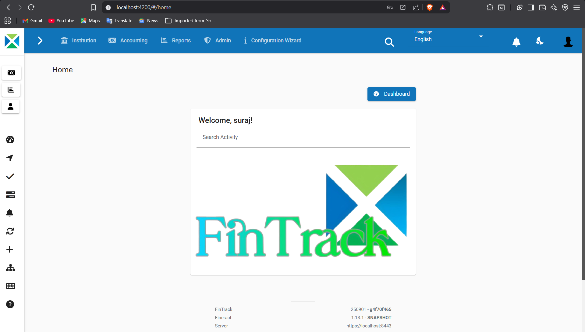
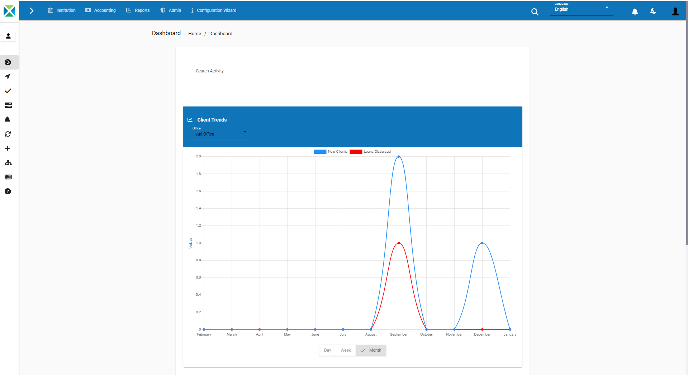
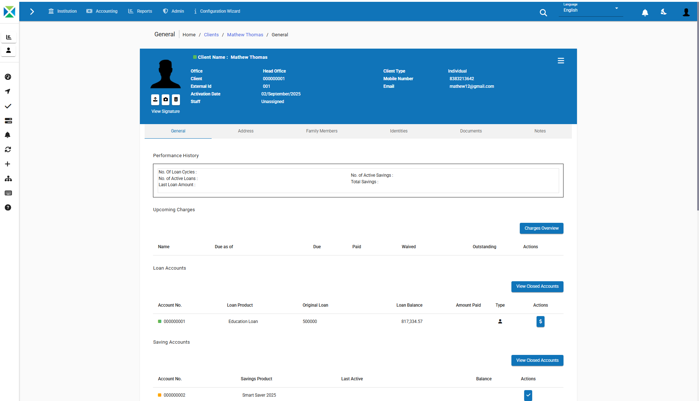
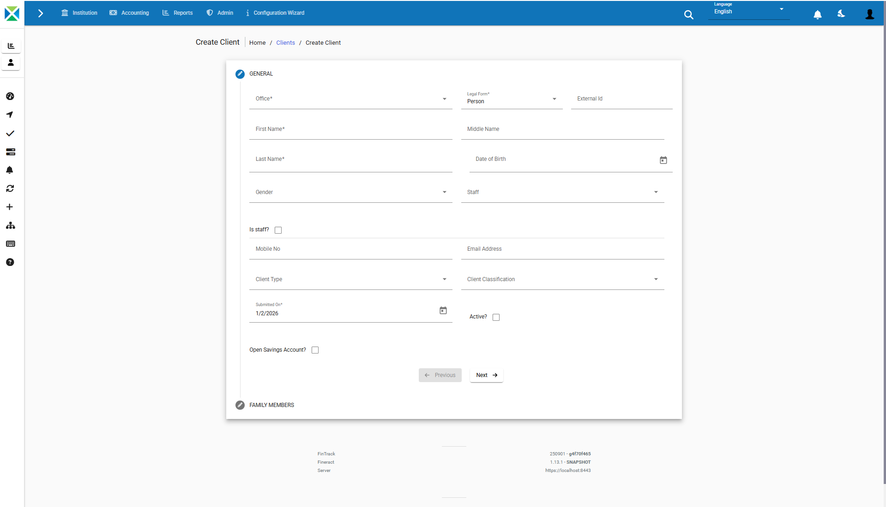

# FinTrack – Accelerating Loan Compliance System

FinTrack is an automated, web-based loan compliance verification system designed to reduce manual effort, improve accuracy, and accelerate regulatory compliance workflows in financial institutions. The system applies rule-based validation with real-time dashboards to ensure consistent and transparent compliance checking.


---

## 📌 Project Overview

Traditional loan compliance verification relies heavily on manual reviews, spreadsheets, and fragmented workflows, making the process slow, error-prone, and inconsistent.  
FinTrack addresses these challenges by automating compliance validation using configurable rules and centralized reporting mechanisms.

---

## 🎯 Key Features

- Rule-based automated loan compliance validation  
- Real-time interactive dashboards for compliance status monitoring  
- Automated compliance report generation (PDF)  
- Audit trail tracking for regulatory transparency  
- Significant reduction in compliance processing time  

---

## 🏗️ System Architecture

FinTrack follows a three-tier architecture:

1. **Presentation Layer**  
   - AngularJS-based responsive web interface  
   - Data entry forms and compliance dashboards  

2. **Application Layer**  
   - Java Spring Boot backend  
   - Custom rule-based validation logic  
   - RESTful APIs for frontend communication  

3. **Data Layer**  
   - MySQL database  
   - Stores loan records, compliance rules, and audit trails  

---

## 🧪 Technology Readiness Level (TRL)

**TRL 6 – Prototype Validated in a Relevant Environment**

The system is a fully integrated prototype tested using representative loan datasets under controlled conditions. Core functionality, performance, and validation accuracy have been demonstrated, making the system suitable for pilot-level deployment and further enhancement.

---

## 🛠️ Technology Stack

- Frontend: AngularJS, HTML5, CSS3  
- Backend: Java Spring Boot  
- Database: MySQL  
- Visualization: Chart.js  
- Server: Apache Tomcat  

---

## 📊 Performance Highlights

| Task | Manual Process | FinTrack |
|----|---------------|---------|
| Validation Check | 10–15 minutes | 2–3 seconds |
| Document Review | 5–10 minutes | Automated |
| Report Generation | 30–45 minutes | 7–8 seconds |
| Dashboard Updates | Manual | Real-time |

---

## 📂 Repository Structure

```text
FinTrack-Loan-Compliance-System/
├── fineract-develop/    # Backend (Apache Fineract + Spring Boot customizations)
├── web-app/             # Frontend (AngularJS application)
├── .gitignore
└── README.md
```
## 🖼️ System Screenshots

### Home Dashboard


### Compliance Analytics Dashboard


### Client Loan & Savings Details


### Loan Data Entry Form



